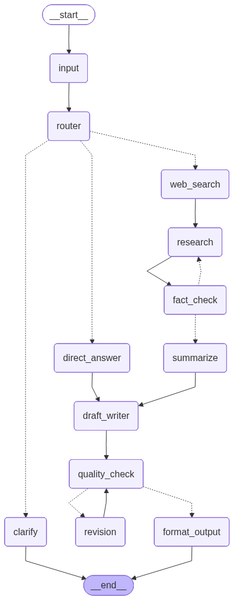

# Research & Writing Assistant — powered by LangGraph

A full LangGraph workflow that takes any topic, searches the web, researches it, writes a draft, revises it, and delivers a polished article — all running locally with Ollama.

---

## What This Project Demonstrates

| Concept | Where |
|---|---|
| Nodes | 12 nodes, each with a single responsibility |
| Regular edges | Linear flow between nodes |
| Conditional edges | `router`, `fact_check`, `quality_check` |
| Cycles / loops | Revision loop and fact-check loop |
| State management | Shared `AgentState` across all nodes |
| Local LLM | Ollama with `qwen3:8b` |
| Web search | DuckDuckGo (free, no API key) |
| UI | Gradio chat interface |
| Visualization | LangGraph Studio |

---

## Workflow Architecture



```
[START]
   │
   ▼
[input_node]
   │
   ▼
[router_node]
   │
   ├── research ──► [web_search_node] ──► [research_node] ──► [fact_check_node]
   │                                                                │
   │                                               score < 6 ◄─────┘ (loop back)
   │                                               score >= 6 ──► [summarize_node]
   │                                                                    │
   ├── simple ──► [direct_answer_node] ─────────────────────────────── ┤
   │                                                                    │
   └── clarify ──► [clarify_node] ──► [END]                            ▼
                                                              [draft_writer_node]
                                                                        │
                                                              [quality_check_node]
                                                                        │
                                                  score < 7 ◄───────────┘ (loop back)
                                                  score >= 7 ──► [format_output_node] ──► [END]
                                                       │
                                                [revision_node]
                                                       │
                                                       └──► [quality_check_node]
```

---

## Project Structure

```
s1/
├── main.py                   ← run from terminal
├── app.py                    ← Gradio chat interface
├── state.py                  ← shared state schema
├── llm.py                    ← Ollama LLM helper
├── graph.py                  ← assembles the full graph
├── langgraph.json            ← LangGraph Studio config
├── requirements.txt
├── test_questions.txt        ← categorized test questions
├── nodes/
│   ├── input_node.py
│   ├── router_node.py
│   ├── clarify_node.py
│   ├── web_search_node.py
│   ├── research_node.py
│   ├── fact_check_node.py
│   ├── summarize_node.py
│   ├── direct_answer_node.py
│   ├── draft_writer_node.py
│   ├── quality_check_node.py
│   ├── revision_node.py
│   └── format_output_node.py
└── edges/
    ├── router_edge.py
    ├── fact_check_edge.py
    └── quality_edge.py
```

---

## Setup

**1. Install dependencies**
```bash
pip install -r requirements.txt
```

**2. Pull the model with Ollama**
```bash
ollama pull qwen3:8b
```

**3. Run from terminal**
```bash
python main.py
```

**4. Run the Gradio UI**
```bash
python app.py
```

**5. Open LangGraph Studio**
```bash
langgraph dev
```

---

## Test Questions

See [`test_questions.txt`](test_questions.txt) for categorized examples covering:
- Research path
- Simple / direct answer path
- Clarify path
- Loop stress tests
- Web search quality tests

---

## Tech Stack

| Tool | Purpose |
|---|---|
| [LangGraph](https://github.com/langchain-ai/langgraph) | Graph workflow orchestration |
| [Ollama](https://ollama.com) | Local LLM inference |
| [qwen3:8b](https://ollama.com/library/qwen3) | Language model |
| [DuckDuckGo (ddgs)](https://github.com/deedy5/ddgs) | Free web search |
| [Gradio](https://gradio.app) | Chat UI |
